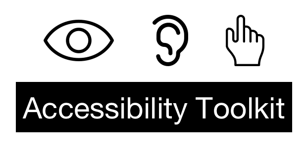

> [!WARNING]
> This is an active rewrite of [A11YTK - Accessibility Toolkit](https://github.com/A11YTK/A11YTK). Please use the original project until the rewrite is complete.

# 

> The Accessibility Toolkit is an open-source Unity package for adding context-aware subtitles in VR, AR, and non-XR environments. Research shows that many digital experiences exclude those with hearing impairments often due to time constraints and budgets. The Accessibility Toolkit allows inclusivity for hard of hearing populations and well as adding the ability to easily internationalize experiences greatly expanding the reach and quality of any project.

## Installation

### Unity Package Manager

<https://docs.unity3d.com/Manual/upm-ui.html>

#### Git

```json
{
  "dependencies": {
    "com.a11ytk.a11ytk": "https://github.com/neogeek/a11ytk-rewrite.git?path=Packages/A11YTK",
    ...
  }
}
```

### Include Tests

```json
{
  "dependencies": {
    "com.unity.test-framework": "1.1.33",
    ...
  },
  "testables": ["com.a11ytk.a11ytk"]
}
```

## Usage

1. Create a GameObject with either a `AudioSource` or a `VideoPlayer` component.
1. Attach a `SubtitleRenderer` component.
1. Connect the `AudioSource` or a `VideoPlayer` component to the `SubtitleRenderer` component.
1. Create a `TextMeshProUGUI` GameObject and attach it to the `SubtitleRenderer` as the text component.
1. (Optional) Create an `Image` GameObject with a dark background and attach it to the `SubtitleRenderer` as the background.
1. Add a `TextAsset` with the contents of an SRT file to the `SubtitleRenderer` or use the `SetSubtitles` method at runtime.
1. (Optional) Set the `Anchors` of the `TextMeshProUGUI` (and `Image`) GameObjects `RectTransform` to anchor the subtitle to the top or bottom.
1. (Optional) Set the `Alignment` of the `TextMeshProUGUI` GameObject to `Center` and `Midline`.
1. (Optional) Set the `Scale` of the `Image` transform to `1.1, 1.1, 1.1` to add padding to the subtitle background.
